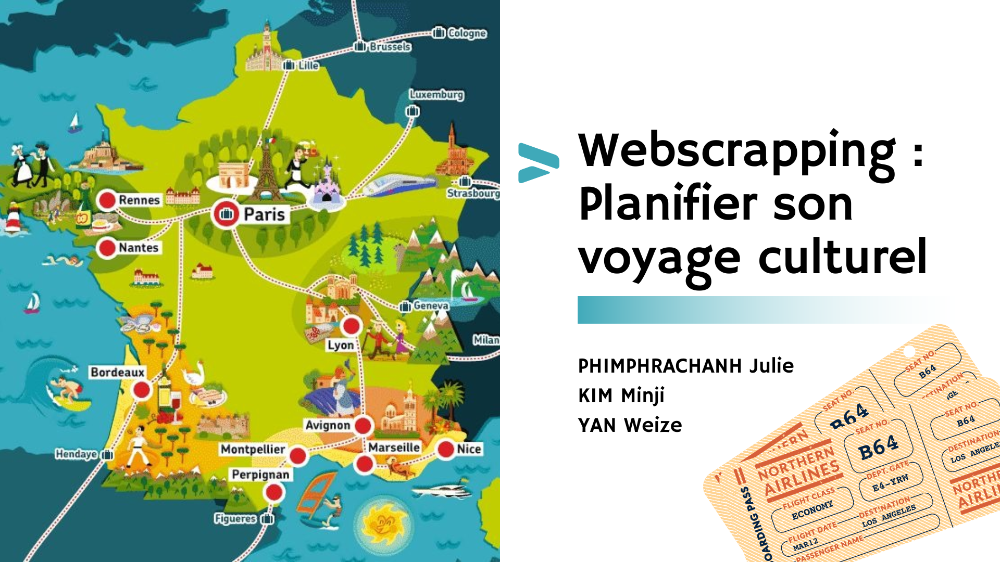

# Train & Culture sur Mesure: Organiser son Voyage Culturel dans les Grandes Villes Françaises selon son Budget

## Contexte
Ce projet vise à renforcer l'économie locale et à valoriser la culture française en proposant des options de voyage écologiques et accessibles. Il permet aux utilisateurs de découvrir et de visualiser une riche sélection d'événements culturels, tout en facilitant la planification de leurs trajets en train. Un aspect unique de l'application est la capacité de voir l'empreinte carbone associée à chaque trajet en train, soulignant ainsi notre engagement envers des voyages plus durables et responsables.

## Description
Ce projet vise à faciliter la planification de voyages culturels dans les grandes villes françaises, en prenant en compte les aspects écologiques et économiques. 
Il intègre le scrapping de données sur des événements culturels via BilletRéduc et l'utilisation de l'API SNCF ou Trainline pour les informations sur les trains. 
Les utilisateurs peuvent visualiser les événements sur une carte interactive et calculer l'empreinte carbone de leurs déplacements, 
s'alignant ainsi avec les engagements de développement durable de la SNCF ([Méthodologie de calcul de l'empreinte carbone](https://www.sncf.com/fr/engagements/developpement-durable/engagement-grand-groupe-pour-la-planete/methodologie-calcul-empreinte-carbone)). 
Ce projet s'inspire de travaux existants sur le scrapping de données de voyages en train avec l'API de Trainline ([Trouvez le billet de train le moins cher](https://www.tducret.com/scraping/2018/09/05/trouvez-le-billet-de-train-le-moins-cher-grace-a-ce-module-python.html)),
et cherche à regrouper et mieux visualiser les événements culturels pour une planification de voyage plus efficace et agréable.

## Utilisation
Visitez [Cultural Streamlit App](https://cultural.streamlit.app/) pour interagir avec l'application. Recherchez des événements culturels, voyez les options de train, visualisez les emplacements sur une carte, et calculez l'empreinte carbone des voyages.

## Installation

```bash
git clone https://github.com/minji-km/cultural-event-and-train-planner-in-France
pip install -r requirements.txt
streamlit run streamlit.py
```


